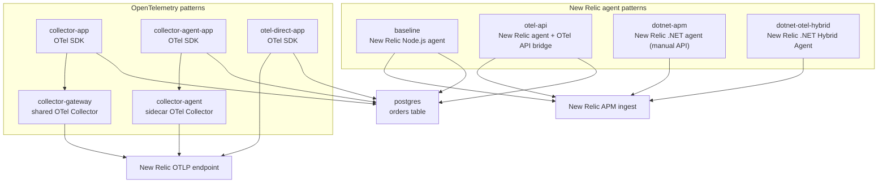

# New Relic APM Pattern Sample

This repository compares New Relic hybrid/APM patterns across Node.js and .NET, plus OpenTelemetry patterns, using the same sample order API.

The app exposes:

- `GET /health`
- `POST /orders`
- `GET /orders/:id`

`POST /orders` produces nested telemetry work for validation, order processing, and payment charging so each pattern can be compared in New Relic.

## Patterns

| Compose service | API port | Pattern | Telemetry path |
| --- | ---: | --- | --- |
| `baseline` | `3000` | New Relic Node.js agent | App process -> New Relic APM |
| `otel-api` | `3001` | New Relic Node.js agent with OTel API bridge | App process -> New Relic APM |
| `dotnet-apm` | `3005` | New Relic .NET agent (no OTel) + New Relic API manual instrumentation | App process -> New Relic APM |
| `dotnet-otel-hybrid` | `3006` | New Relic .NET Hybrid Agent (OTel API support) + OTel manual instrumentation | App process -> New Relic APM |
| `collector-app` | `3002` | OTel SDK with Collector gateway | App -> shared OTel Collector -> New Relic OTLP |
| `collector-agent-app` | `3003` | OTel SDK with Collector sidecar/agent | App -> colocated OTel Collector -> New Relic OTLP |
| `otel-direct-app` | `3004` | OTel SDK direct-to-New Relic | App -> New Relic OTLP |

The New Relic Node.js agent is an in-process agent. There is no separate New Relic Node.js agent sidecar pattern here; sidecar/agent mode is represented with the OpenTelemetry Collector.

## Topology



## Repository Layout

- [compose.yaml](compose.yaml): root Compose file for all patterns.
- [apps/baseline](apps/baseline): New Relic Node.js agent sample.
- [apps/otel-api](apps/otel-api): New Relic Node.js agent with OTel API bridge sample.
- [apps/dotnet-apm](apps/dotnet-apm): New Relic .NET APM sample without OTel, including manual instrumentation via `NewRelic.Agent.Api`.
- [apps/dotnet-otel-hybrid](apps/dotnet-otel-hybrid): New Relic .NET Hybrid Agent sample with OTel API support and manual instrumentation via OpenTelemetry API.
- [apps/collector](apps/collector): OTel SDK app used by gateway, sidecar/agent, and direct modes.
- [otel/collector-gateway.yaml](otel/collector-gateway.yaml): shared Collector gateway config.
- [otel/collector-agent.yaml](otel/collector-agent.yaml): sidecar/agent Collector config.
- [scenarios](scenarios): k6 order-flow scenario.

## Quick Start

Create an environment file and set your New Relic license key:

```bash
cp .env.example .env
```

Edit `.env`:

```bash
NEW_RELIC_LICENSE_KEY=...
NEW_RELIC_LOG_LEVEL=info
INTERNAL_TELEMETRY_NEW_RELIC_LICENSE_KEY=...
INTERNAL_TELEMETRY_METRICS_LEVEL=normal
```

`INTERNAL_TELEMETRY_NEW_RELIC_LICENSE_KEY` is optional. When it is unset, the Collector startup command falls back to `NEW_RELIC_LICENSE_KEY`.

Start all patterns:

```bash
docker compose up --build
```

In this local environment, `docker` may be an alias to `podman`. If needed, run through a login shell so aliases are loaded:

```bash
zsh -lic 'docker compose up --build'
```

The Collector containers now start with two config files:

- `/etc/otelcol/config.yaml`
- `/etc/otelcol/config-internal.yaml`

The order matters. `config-internal.yaml` is loaded last so its `service.telemetry` settings win.

## Ports

| Service | API | Fake external service |
| --- | ---: | ---: |
| `baseline` | `3000` | `4001` |
| `otel-api` | `3001` | `4002` |
| `collector-app` | `3002` | `4003` |
| `collector-agent-app` | `3003` | `4004` |
| `otel-direct-app` | `3004` | `4005` |
| `dotnet-apm` | `3005` | in-process `/fake/charge` |
| `dotnet-otel-hybrid` | `3006` | in-process `/fake/charge` |
| `postgres` | `55432` | n/a |

Health check example:

```bash
curl http://127.0.0.1:3004/health
```

Order example:

```bash
curl -X POST http://127.0.0.1:3004/orders \
  -H 'content-type: application/json' \
  -d '{
    "userId": "demo-user",
    "paymentToken": "approved",
    "items": [
      { "sku": "sku-1", "quantity": 1, "unitPrice": 100 }
    ]
  }'
```

Use `paymentToken: "declined"` to exercise the failed-payment path. It should return HTTP `402`.

## New Relic Verification

Expected service/entity names:

- `newrelic-apm-pattern-sample-baseline`
- `newrelic-apm-pattern-sample-otel-api`
- `newrelic-apm-pattern-sample-dotnet-apm`
- `newrelic-apm-pattern-sample-dotnet-otel-hybrid`
- `newrelic-apm-pattern-sample-collector`
- `newrelic-apm-pattern-sample-collector-agent`
- `newrelic-apm-pattern-sample-otel-direct`

Dotnet patterns:

- `dotnet-apm` uses New Relic .NET agent only (no OpenTelemetry support block in `newrelic.config`) and manual instrumentation via `NewRelic.Agent.Api`.
- `dotnet-otel-hybrid` enables OpenTelemetry API support in `apps/dotnet-otel-hybrid/newrelic.config` with:
  - `<openTelemetry enabled="true">`
  - `<traces include="newrelic-apm-pattern-sample-dotnet-otel-hybrid" />`
  - `<metrics include="newrelic-apm-pattern-sample-dotnet-otel-hybrid" export_interval="10000" />`

Useful NRQL checks:

```sql
SELECT count(*)
FROM Transaction
WHERE appName LIKE 'newrelic-apm-pattern-sample%'
SINCE 30 minutes ago
FACET appName
```

```sql
SELECT count(*)
FROM Transaction
WHERE appName IN (
  'newrelic-apm-pattern-sample-dotnet-apm',
  'newrelic-apm-pattern-sample-dotnet-otel-hybrid'
)
SINCE 30 minutes ago
FACET appName
```

```sql
SELECT count(*)
FROM Span
WHERE name IN (
  'validate-order',
  'process-order',
  'charge-payment',
  'db.create-order-draft',
  'db.confirm-order',
  'db.fail-order',
  'db.get-order'
)
SINCE 30 minutes ago
FACET entity.name, service.name, appName, name
```

Check that Postgres auto-instrumentation is producing database spans or datastore segments:

```sql
SELECT count(*)
FROM Span
WHERE (
  db.system = 'postgresql'
  OR category = 'datastore'
  OR name LIKE '%Postgres%'
  OR name LIKE '%pg%'
)
AND (
  service.name LIKE 'newrelic-apm-pattern-sample%'
  OR appName LIKE 'newrelic-apm-pattern-sample%'
)
SINCE 30 minutes ago
FACET entity.name, service.name, appName, name, db.operation
```

```sql
SELECT count(*)
FROM Metric
WHERE (
  service.name LIKE 'newrelic-apm-pattern-sample%'
  OR entity.name LIKE 'newrelic-apm-pattern-sample%'
)
SINCE 30 minutes ago
FACET entity.name, service.name, metricName
```

For `otel-api` custom metrics (`orders.created`, `orders.failed`, `orders.confirmation_failed`, `checkout.duration`), first discover the target `entity.guid`. Some datapoints can have `entity.name`/`service.name` unset:

```sql
SELECT uniques(entity.guid), latest(entity.name), latest(service.name)
FROM Metric
WHERE metricName IN (
  'orders.created',
  'orders.failed',
  'orders.confirmation_failed',
  'checkout.duration'
)
AND (
  appName = 'newrelic-apm-pattern-sample-otel-api'
  OR service.name = 'newrelic-apm-pattern-sample-otel-api'
  OR entity.name = 'newrelic-apm-pattern-sample-otel-api'
)
SINCE 30 minutes ago
FACET metricName
```

Then query with the discovered guid:

```sql
SELECT count(*)
FROM Metric
WHERE entity.guid = '<paste-entity-guid>'
AND metricName IN (
  'orders.created',
  'orders.failed',
  'orders.confirmation_failed',
  'checkout.duration'
)
SINCE 30 minutes ago
FACET metricName, entity.guid, entity.name
```

## Collector Observability

`collector-gateway` and `collector-agent` now export the Collector process's own internal metrics to New Relic. This is separate from the application telemetry flowing through those Collectors.

Expected Collector entity names:

- `newrelic-apm-pattern-sample-collector-gateway`
- `newrelic-apm-pattern-sample-collector-agent`

What was added:

- `otel/internal-telemetry-config.yaml` enables Collector internal telemetry export.
- `newrelic.service.type: otel_collector` is attached to the internal telemetry resource so the Collector-specific UI is enabled.
- Both Collector services load the internal telemetry config after the main pipeline config.

How to verify:

1. Start the stack with `docker compose up --build`.
2. Open New Relic `APM & Services > Services - OpenTelemetry`.
3. Look for the two Collector entities above.
4. Open each entity and confirm the `Summary` and `Process` views show Collector health, CPU, memory, and pipeline activity.

Useful NRQL checks:

```sql
SELECT count(*)
FROM Metric
WHERE newrelic.service.type = 'otel_collector'
SINCE 30 minutes ago
FACET service.name
```

```sql
SELECT uniques(metricName)
FROM Metric
WHERE newrelic.service.type = 'otel_collector'
SINCE 30 minutes ago
FACET service.name
```

Defaults and operational notes:

- Internal telemetry metrics start at `INTERNAL_TELEMETRY_METRICS_LEVEL=normal`.
- The internal telemetry export interval and timeout use milliseconds:
  - `INTERNAL_TELEMETRY_METRICS_INTERVAL_MS=30000`
  - `INTERNAL_TELEMETRY_METRICS_TIMEOUT_MS=10000`
- Collector internal traces are left disabled by default in this sample to avoid unnecessary ingest. Enable them only during focused debugging by extending `otel/internal-telemetry-config.yaml`.
- Internal log volume is controlled with the `INTERNAL_TELEMETRY_LOGS_SAMPLING_*` environment variables.
- Sending Collector internal telemetry increases ingest volume.
- This is a preview workflow, so upstream config shape may change over time.

For the OpenTelemetry-only services, New Relic's OTel APM experience is driven by semantic-convention HTTP metrics. Check that `http.server.request.duration` and the derived `apm.service.transaction.duration` are populated:

```sql
SELECT
  rate(count(apm.service.transaction.duration), 1 minute),
  percentile(apm.service.transaction.duration, 50, 95, 99),
  average(http.server.request.duration)
FROM Metric
WHERE service.name IN (
  'newrelic-apm-pattern-sample-collector',
  'newrelic-apm-pattern-sample-collector-agent',
  'newrelic-apm-pattern-sample-otel-direct'
)
SINCE 10 minutes ago
FACET service.name
```

## Load Test

Use [scenarios/k6-orders.js](scenarios/k6-orders.js) to run the same order flow against any pattern.

Examples:

```bash
BASE_URL=http://127.0.0.1:3000 k6 run scenarios/k6-orders.js
BASE_URL=http://127.0.0.1:3001 k6 run scenarios/k6-orders.js
BASE_URL=http://127.0.0.1:3002 k6 run scenarios/k6-orders.js
BASE_URL=http://127.0.0.1:3003 k6 run scenarios/k6-orders.js
BASE_URL=http://127.0.0.1:3004 k6 run scenarios/k6-orders.js
```

See [scenarios/README.md](scenarios/README.md) for all environment variables.

## Notes

- `collector-gateway` listens on `0.0.0.0:4317` and `0.0.0.0:4318` because it receives OTLP from another container.
- `collector-agent` can keep the default localhost receiver behavior because it shares the app container's network namespace through `network_mode: "service:collector-agent-app"`.
- `otel-direct-app` sends OTLP/HTTP directly to `https://otlp.nr-data.net:4318` and uses `NEW_RELIC_LICENSE_KEY` as the OTLP `api-key` header.
- OTel-only services set `OTEL_SEMCONV_STABILITY_OPT_IN=http/dup`, `OTEL_EXPORTER_OTLP_METRICS_TEMPORALITY_PREFERENCE=delta`, and `OTEL_EXPORTER_OTLP_METRICS_DEFAULT_HISTOGRAM_AGGREGATION=base2_exponential_bucket_histogram` so New Relic can derive APM metrics from `http.server.request.duration`.
- All app patterns connect to the shared `postgres` service through `DATABASE_URL`. The app writes orders to the `orders` table and reads them back through `GET /orders/:id`.
- Manual instrumentation is intentionally present in all patterns.
- `baseline` uses the New Relic agent API for spans, metrics, and logs.
- `otel-api` uses the OTel API bridge for manual spans, metrics, and logs while keeping the New Relic APM agent for auto instrumentation and APM integration.
- OTel-only modes use the OpenTelemetry API and SDK for spans, metrics, and logs.
- OTel-only services explicitly register `@opentelemetry/instrumentation-pg` and import the shared app core after `NodeSDK.start()`. Loading `pg` before SDK startup prevents the OTel instrumentation from patching the client.
