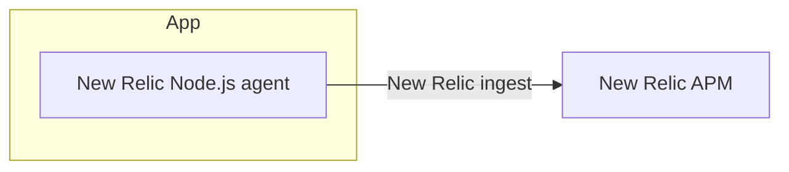

# Baseline App

This is the Pattern B baseline app: the Node.js app runs with the New Relic agent and sends telemetry directly to New Relic.

## Telemetry flow



- HTTP request tracing is handled by the New Relic agent.
- Custom telemetry is minimal in this pattern, so the agent-instrumented flow is the baseline.

## Run locally

```bash
cd apps/baseline
pnpm install
pnpm build
NEW_RELIC_APP_NAME=newrelic-apm-pattern-sample-baseline \
NEW_RELIC_LICENSE_KEY=... \
pnpm start
```

`newrelic.cjs` reads `NEW_RELIC_APP_NAME`, `NEW_RELIC_LICENSE_KEY`, and `NEW_RELIC_LOG_LEVEL`.

## Run with Docker

```bash
cd ../..
cp .env.example .env
docker compose up --build
```

This starts all patterns. Baseline listens on `http://127.0.0.1:3000`.

## Endpoints

- `GET /health`
- `POST /orders`
- `GET /orders/:id`

## Example request

```bash
curl -X POST http://127.0.0.1:3000/orders \
  -H 'content-type: application/json' \
  -d '{
    "userId": "user-1",
    "paymentToken": "tok_123",
    "items": [
      { "sku": "coffee", "quantity": 2, "unitPrice": 500 }
    ]
  }'
```
