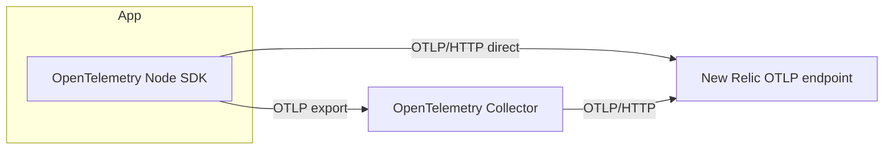

# Collector App

This is the full OpenTelemetry app: the Node.js app emits OpenTelemetry traces, metrics, and logs through OTLP. It can send telemetry to an OpenTelemetry Collector or directly to New Relic.

## Telemetry flow



- The app exports telemetry through OTLP instead of the New Relic agent.
- The Collector can batch and forward traces, metrics, and logs to New Relic.
- Direct mode sends OTLP/HTTP from the app to the New Relic OTLP endpoint with the license key as the `api-key` header.

## Deployment modes

- Gateway mode: one shared collector receives OTLP from the app and forwards it to New Relic.
- Agent mode: one collector runs next to the app and receives OTLP on `127.0.0.1:4318`.
- Direct mode: the app sends OTLP/HTTP directly to `https://otlp.nr-data.net:4318`.

## Run locally

```bash
cd apps/collector
pnpm install
pnpm build
OTEL_EXPORTER_OTLP_ENDPOINT=http://127.0.0.1:4318 \
pnpm start
```

For direct mode:

```bash
OTEL_EXPORTER_OTLP_ENDPOINT=https://otlp.nr-data.net:4318 \
OTEL_SERVICE_NAME=newrelic-apm-pattern-sample-otel-direct \
NEW_RELIC_LICENSE_KEY=... \
pnpm start
```

## Run with Docker

```bash
cd ../..
cp .env.example .env
docker compose up --build
```

This starts the collector variants and direct mode at once:

- Gateway mode: `http://127.0.0.1:3002`
- Agent mode: `http://127.0.0.1:3003`
- Direct mode: `http://127.0.0.1:3004`
