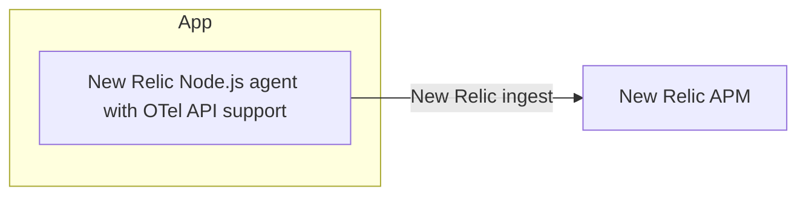

# OTel API App

This is Pattern C: the Node.js app still runs with the New Relic agent, but custom telemetry is emitted through the OpenTelemetry API.

## Telemetry flow



- The app writes custom spans, metrics, and logs with the OTel API.
- The New Relic agent captures that OTel telemetry and ships it to New Relic.

## Run locally

```bash
cd apps/otel-api
pnpm install
pnpm build
NEW_RELIC_APP_NAME=newrelic-apm-pattern-sample-otel-api \
NEW_RELIC_LICENSE_KEY=... \
pnpm start
```

`newrelic.cjs` enables OpenTelemetry API support for the Node.js agent.

## Run with Docker

```bash
cd ../..
cp .env.example .env
docker compose up --build
```

This starts all patterns. OTel API listens on `http://127.0.0.1:3001`.

## Endpoints

- `GET /health`
- `POST /orders`
- `GET /orders/:id`
